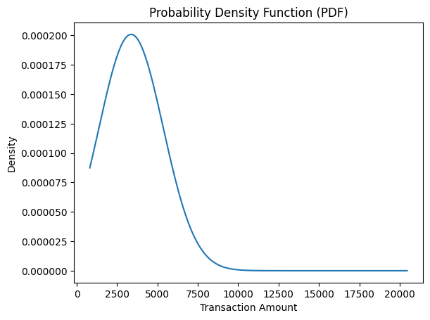
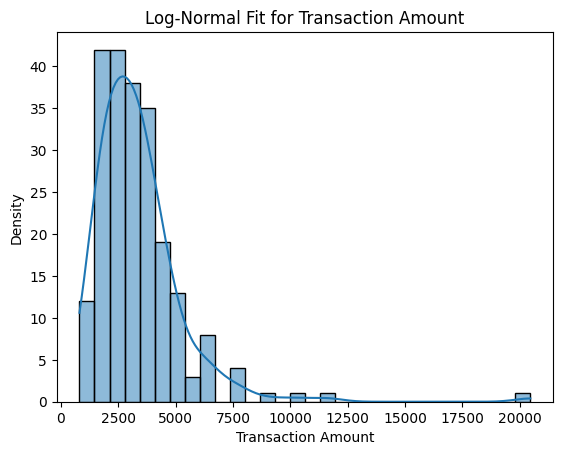
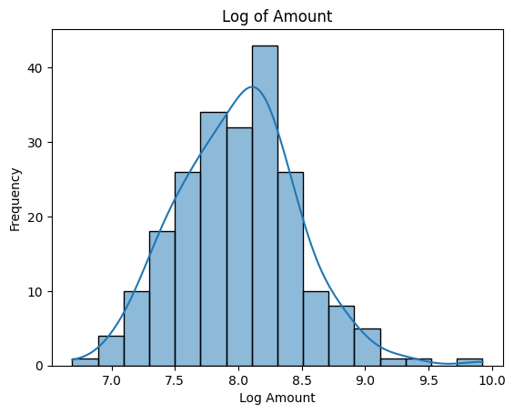
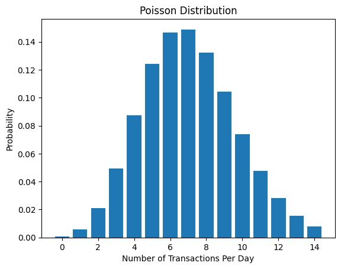
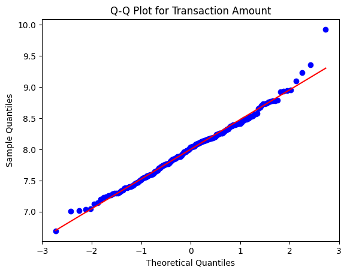
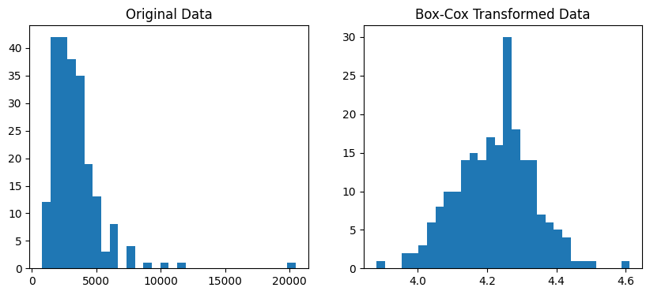
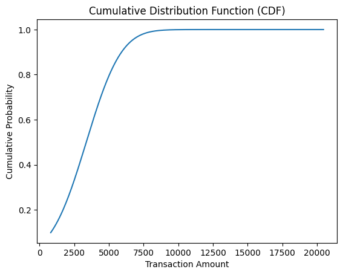

# 📊 Spread Locator – Statistical Distribution Analysis

## 🔍 Project Overview

This project analyzes customer transaction behavior using probability distributions and statistical modeling techniques.  
The goal is to identify which statistical distributions best describe transaction occurrences, counts, and transaction amounts.

The project combines theoretical understanding with practical implementation using Python.

---

## 📁 Dataset

Dataset used in this project:

🔗 **CSV File:**  
[spread_locator_dataset.csv](./spread_locator_dataset.csv)

Columns included:

- `transaction_id` – Unique transaction identifier  
- `customer_id` – Unique customer identifier  
- `transaction_amount` – Transaction value (₹)  
- `transaction_date` – Date of transaction  
- `transaction_count` – Weekly transaction count  
- `region` – Customer region (North, South, East, West)  
- `transaction_status` – Success / Failure  

---

## 🛠 Technologies Used

- Python
- NumPy
- Pandas
- SciPy
- Statsmodels
- Matplotlib
- Seaborn
- Jupyter Notebook

---

## 📊 Statistical Models Applied

### 1️⃣ Bernoulli Distribution
Used to model transaction success or failure.

### 2️⃣ Binomial Distribution
Used for modeling weekly transaction counts.

### 3️⃣ Poisson Distribution
Used to model daily transaction frequency.

### 4️⃣ Log-Normal Distribution
Used for transaction amounts due to positive skewness.

### 5️⃣ Power Law Distribution
Used to analyze heavy-tail behavior in high-value transactions.

### 6️⃣ Q-Q Plot
Used to test normality assumption.

### 7️⃣ Box-Cox Transformation
Applied to stabilize variance and reduce skewness.

### 8️⃣ Z-Score Probability
Calculated probability of transactions exceeding ₹5000.

### 9️⃣ PDF & CDF
Visualized probability density and cumulative probability functions.

---

## ▶ How to Run the Project

1️⃣ Clone this repository:

```bash
git clone https://github.com/your-username/spread-locator.git
```

2️⃣ Install required libraries:

```bash
pip install numpy pandas scipy statsmodels matplotlib seaborn
```

3️⃣ Open Jupyter Notebook:

```bash
jupyter notebook Transaction_Distribution.ipynb
```

---

## 📈 Key Insights

- Transaction success follows Bernoulli behavior.
- Weekly counts align with Binomial distribution.
- Daily transactions fit Poisson assumptions.
- Transaction amounts are highly right-skewed.
- Log-Normal distribution fits better than Normal.
- Heavy-tail behavior observed for large-value transactions.
- Box-Cox improved distribution symmetry.

---

## 💼 Business Interpretation

- High-value transactions are rare but impactful.
- Statistical modeling improves:
  - Revenue forecasting
  - Risk management
  - Fraud detection
  - Customer behavior analysis
- Distribution-based insights support data-driven decision-making.

---

## 📂 Project Structure

```
Spread-Locator/
│
├── spread_locator_dataset.csv
├── Transaction_Distribution.ipynb
├── Statistical_Distribution_Report.pdf
└── README.md
```

---

## 🎓 Learning Outcomes

- Applied probability distributions on real dataset
- Practiced distribution fitting
- Performed statistical testing
- Interpreted PDF & CDF
- Connected statistical theory with business insights

---
---

# 📊 Visual Analysis Outputs & Interpretation

---

## 1️⃣ Probability Density Function (PDF)

<p align="center">
  
</p>

**Interpretation:**
- Shows probability density of transaction amounts.
- Distribution is highly right-skewed.
- Majority of transactions occur in lower range.
- High-value transactions have low probability but long tail impact.

---

## 2️⃣ Log-Normal Distribution Fit

<p align="center">
  
</p>

**Interpretation:**
- Transaction amounts follow Log-Normal behavior.
- Better fit compared to Normal distribution.
- Suitable for modeling financial data.
- Captures skewness and heavy-tail characteristics.

---

## 3️⃣ Log of Transaction Amount (Normality Check)

<p align="center">
  
</p>

**Interpretation:**
- After log transformation, distribution becomes approximately Normal.
- Confirms assumption of Log-Normal distribution.
- Reduces skewness significantly.
- Useful for statistical modeling and hypothesis testing.

---

## 4️⃣ Poisson Distribution (Transaction Frequency)

<p align="center">
  
</p>

**Interpretation:**
- Models number of transactions per day.
- Suitable for count-based event modeling.
- Mean ≈ Variance condition approximately satisfied.
- Useful for forecasting daily transaction load.

---

## 5️⃣ Q-Q Plot (Normality Test)

<p align="center">
  
</p>

**Interpretation:**
- Points align closely with diagonal line.
- Indicates log-transformed data follows Normal distribution.
- Minor deviation in extreme tails (expected in financial data).

---

## 6️⃣ Box-Cox Transformation

<p align="center">
  
</p>

**Interpretation:**
- Applied to stabilize variance.
- Reduced skewness further.
- Improved symmetry of distribution.
- Enhances model assumptions for parametric testing.

---

## 7️⃣ Cumulative Distribution Function (CDF)

<p align="center">
  
</p>

**Interpretation:**
- Shows cumulative probability of transaction amounts.
- Helps estimate probability of transactions below certain threshold.
- Useful for risk assessment and revenue distribution analysis.

---

# 📌 Overall Insight

- Financial transaction data does not follow pure Normal distribution.
- Log-Normal model best describes transaction amounts.
- Poisson effectively models transaction frequency.
- Transformations like Log & Box-Cox improve statistical assumptions.
- Heavy-tail behavior indicates rare but high-impact transactions.

---
## 👨‍💻 Author

Krisha anghan
AI/ML & Data Science Student  

---

## ⭐ Final Conclusion

Real-world transaction data does not perfectly follow Normal distribution.  
Log-Normal and Power Law models better capture financial transaction behavior, while Poisson and Binomial effectively model event frequency.

This project demonstrates strong understanding of statistical theory with practical implementation.